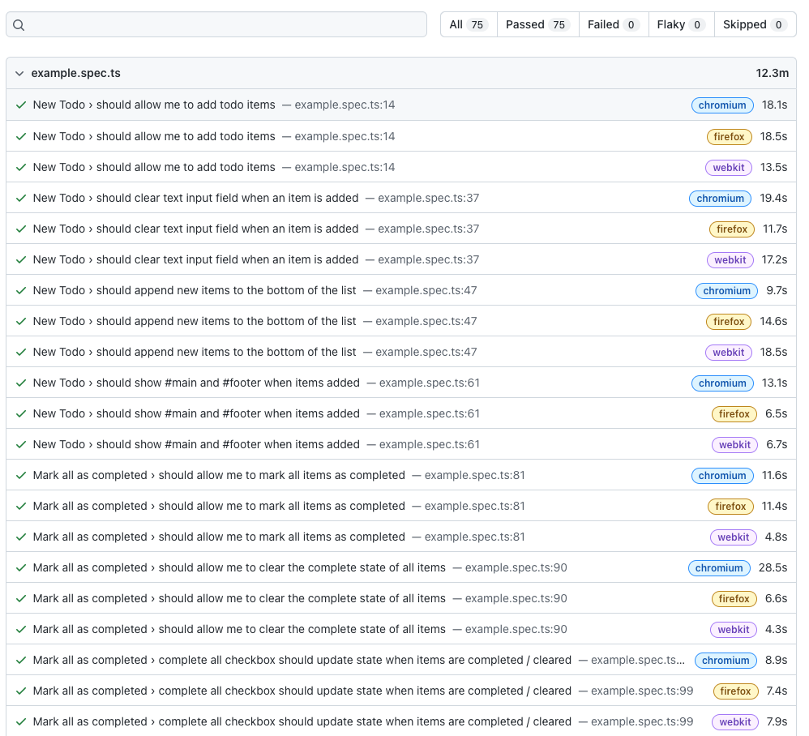

# Try Playwright

> Oh my Playwright: https://playwright.dev/

## Getting Started

`npx playwright test`
  Runs the end-to-end tests.

`npx playwright test --project=chromium`
  Runs the tests only on Desktop Chrome.

`npx playwright test example.spec.ts`
  Runs the tests in the specific file.

`npx playwright test --debug`
  Runs the tests in debug mode.

We suggest that you begin by typing:

`npx playwright test`
